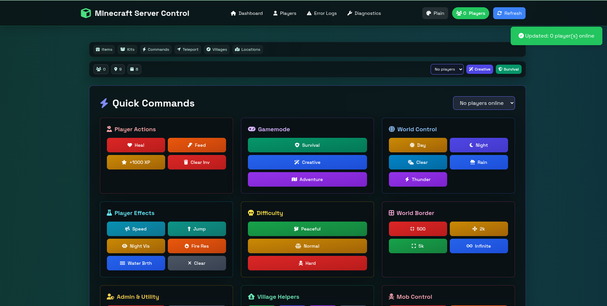
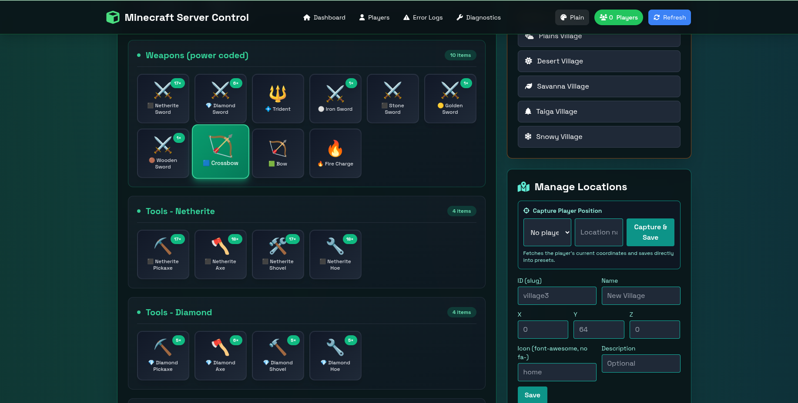
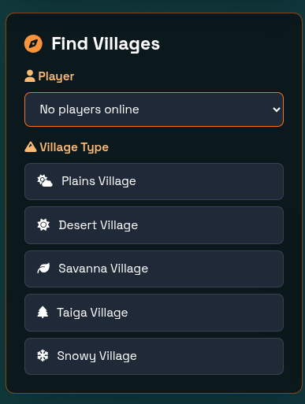

# Mineboard - Minecraft Server Control

## What this is
**Mineboard** is a multi-tenant Flask dashboard that allows each user to connect and control their own Minecraft server over RCON. It wraps common admin tasks (teleport, give items, run kits, quick gamerule toggles, whitelist/op, weather/time, locate villages) behind a web UI and a small REST API.

**Multi-Tenant Architecture:** Each user can configure their own RCON connection to manage their personal Minecraft server. Multiple users can use the same Mineboard instance to manage different servers simultaneously.

> **Disclaimer:** Mineboard is not affiliated with Mojang Studios or Microsoft. Minecraft is a trademark of Mojang Studios.

## ✨ Features

### 🎮 Player Management
- **Real-time Player Tracking** - View online players with auto-refresh every 10 seconds
- **Teleportation System** - Quick teleport players to each other or saved locations
- **Coordinate Teleport** - Send players to specific X, Y, Z coordinates
- **Player Statistics** - View detailed stats (deaths, kills, playtime, etc.) via API
- **Whitelist & OP Management** - Add/remove players from whitelist and operator lists

### 📦 Item & Kit Management
- **Predefined Kits** - Starter, Tools, Diamond Armor, Netherite, Building, Farming, Redstone kits
- **Custom Item Giving** - Give any Minecraft item with custom amounts to players
- **Visual Item Selection** - Browse items with icons and search functionality
- **Enchantment Support** - Give enchanted items with specific enchantments

### 🗺️ Location Management
- **Save Locations** - Store important coordinates with names and descriptions
- **Quick Teleport** - One-click teleport to saved locations
- **Locate Structures** - Find villages, strongholds, temples, and other structures
- **Persistent Storage** - All locations saved in SQLite database per user

### ⚙️ Server Controls
- **Quick Commands** - One-click access to common server operations
  - Weather control (clear/rain/thunder)
  - Time control (day/night/noon/midnight)
  - Game rules (PVP, keepInventory, doMobSpawning, etc.)
- **Custom Commands** - Execute any RCON command directly
- **Batch Operations** - Execute multiple commands at once

### 👥 Multi-Tenant & Multi-User System
- **Multi-Tenant Architecture** - Each user connects to their own Minecraft server
- **Individual RCON Configuration** - Per-user server connection settings
- **User Authentication** - Secure login system with Flask-Login
- **Role-Based Access** - Admin and regular user roles
- **User Management** - Admin panel to create/manage users
- **Isolated User Data** - Each user has their own saved locations and settings

### 🎨 Modern UI/UX
- **Minecraft-Themed Design** - Pixel fonts and block-style elements
- **5 Theme Modes** - Grass Plains, Desert, Ocean, Nether, The End
- **Responsive Design** - Works on desktop, tablet, and mobile
- **Dark Mode** - Easy on the eyes with beautiful gradients
- **Real-time Notifications** - Toast notifications for all actions

### 🛠️ Technical Features
- **Multi-Tenant Support** - Multiple users managing separate servers
- **Per-User RCON Connections** - Each user maintains their own server connection
- **RESTful API** - JSON endpoints for all operations
- **Error Logging** - Track and view RCON command errors
- **Docker Support** - Easy deployment with Docker Compose
- **RCON Connection Pool** - Efficient connection reuse per user
- **Diagnostics Page** - Test connectivity and view server status

## 🚀 Upcoming Features

- [ ] **Command Scheduling** - Schedule commands to run at specific times
- [ ] **Backup Management** - Automated world backup and restore
- [ ] **Plugin Integration** - Support for popular server plugins
- [ ] **Advanced Permissions** - Fine-grained permission system
- [ ] **Player Activity Dashboard** - Charts and graphs for player activity
- [ ] **Multi-Server per User** - Allow one user to manage multiple servers
- [ ] **Discord Integration** - Link commands and notifications to Discord
- [ ] **Web Console** - Real-time server console in the browser
- [ ] **Economy System** - Virtual currency and shop integration
- [ ] **Ban Management** - Ban/unban players with reasons and durations
- [ ] **World Management** - Switch between worlds/dimensions
- [ ] **Performance Metrics** - TPS, RAM, CPU usage monitoring
- [ ] **Custom Kit Builder** - Create and edit kits via UI
- [ ] **Audit Logs** - Track all admin actions with timestamps

## 📋 Prerequisites

Before setting up Mineboard, ensure you have:
- A running Minecraft server with RCON enabled
- RCON port accessible from where Mineboard is hosted

**Don't have a Minecraft server?** Check out our [Minecraft Server Setup Guide](minecraft_server/README.md) for a quick Docker-based server deployment.

## 🚀 Installation & Setup

### ⭐ Recommended: One-Click Installation

**Prerequisites:** Python 3.8+, wget, and root access

Download and install Mineboard with a single command:

```bash
# Download the installer
wget https://raw.githubusercontent.com/codeperfectplus/mineboard/refs/heads/main/deploy-native.sh

# Make it executable and run
chmod +x deploy-native.sh
sudo ./deploy-native.sh --install
```

This will automatically:
- Clone the repository
- Create a dedicated `mineboard` system user
- Set up a Python virtual environment at `/opt/mineboard`
- Install all dependencies
- Configure systemd service for automatic startup
- Start Mineboard on port 5090
- default user: admin / password: admin (change on first login)

**Uninstall:**
```bash
sudo ./deploy-native.sh --uninstall
```

---

### Alternative: Docker Deployment (Development)

**Prerequisites:** Docker and Docker Compose installed

```bash
# Clone the repository
git clone https://github.com/codeperfectplus/mineboard.git
cd mineboard

# Using Docker Compose
docker compose up -d --build

# Or using the convenience script
bash up.sh
```
---

### After Installation

**Service Management:**
```bash
sudo systemctl start mineboard    # Start the service
sudo systemctl stop mineboard     # Stop the service
sudo systemctl restart mineboard  # Restart the service
sudo systemctl status mineboard   # Check status
sudo journalctl -u mineboard -f   # View logs
```

**Access the Dashboard:**
Open your browser and navigate to:
```
http://localhost:5090
```

### Configure Your Server
```
http://localhost:5090
```

### Configure Your Server
1. **Login** with default credentials (if set) or create your first admin user
2. **Go to Settings** page
3. **Configure your RCON connection:**
   - Enter your Minecraft server **Host** (e.g., `172.17.0.1` or `minecraft-server`)
   - Enter your RCON **Port** (default: `25575`)
   - Enter your RCON **Password** (must match your server's `rcon.password`)
4. **Click "Test Connection"** button to verify connectivity
5. **Save Configuration** once the test succeeds

**✅ That's it!** Each user can configure their own server connection in the Settings page.

## 🔧 High-Level Architecture
- **Flask App** - Exposes UI + RESTful JSON endpoints
- **RCON Client** - Maintains persistent connection to each user's Minecraft server
- **SQLite Database** - Stores user accounts and saved locations per user
- **JSON Config Files** - Predefined kits and quick commands
- **Docker Support** - Easy deployment with persistent data at `/app/data`

## 🎮 Setting Up Your Minecraft Server

Need to set up a Minecraft server with RCON enabled? We've got you covered!

👉 **[Minecraft Server Setup Guide](minecraft_server/README.md)** - Complete guide to deploy a Docker-based Minecraft server

**Key Requirements for RCON:**
- `enable-rcon=true` in `server.properties`
- `rcon.port=25575` (or your custom port)
- `rcon.password=your_password` (must match Mineboard settings)

## 💡 Usage Tips

### For Multi-Tenant Setup
- Each user logs in and configures their own server connection
- No shared RCON credentials - everyone manages their own server
- Admins can create user accounts via the User Management page

### Testing Connection
- Always use the **"Test Connection"** button in Settings before saving
- If connection fails, verify:
  - Server IP/hostname is correct
  - RCON port is open and accessible
  - RCON password matches your server configuration
  - Firewall allows RCON connections

## 📸 Screenshots

### Dashboard Main View


### Player Management


### Diagnostics View


### Commands Interface


## 💬 Need Help?

**Want to deploy your Minecraft server and Mineboard but need assistance?**  
**Looking to set up a server to play with friends?**  

We're here to help! Whether you need support with:
- 🚀 Deploying and configuring Mineboard
- 🎮 Setting up your Minecraft server
- 🔧 Troubleshooting RCON connections
- 👥 Creating a server for you and your friends

📧 **Contact us:** deepak008live.com

We'll help you get up and running so you can enjoy managing your Minecraft server with ease!

## 🤝 Contributing

Contributions are welcome! Please feel free to submit a Pull Request.

## 📄 License

This project is licensed under the MIT License - see the [LICENSE](LICENSE) file for details.

## 🙏 Acknowledgments

- Built with [Flask](https://flask.palletsprojects.com/)
- Uses [mcrcon](https://github.com/barneygale/MCRcon) for RCON connectivity
- Inspired by the [itzg/minecraft-server](https://github.com/itzg/docker-minecraft-server) Docker image
- Minecraft is a trademark of Mojang Studios
